

# Aula 03 — Interrupções e Timers no Arduino
*Gabriel Couto Assis*\
*Lucas de Souza Gontijo*\
*Mateus Henrique Pereira*\
*Matheus Henrique Alves*
#### CEFET-MG, Campus V
#### Laboratório de Microcontroladores e Microprocessadores - Engenharia de Computação

## Introdução
Nos últimos anos, os microcontroladores têm desempenhado um papel importante e têm impulsionando a criação de uma ampla variedade de dispositivos inteligentes e sistemas embarcados. Esses dispositivos compactos, com grande de capacidade de processamento e memória, são capazes de executar tarefas específicas de controle e interação com o ambiente físico.

Uma das plataformas mais populares para desenvolvimento com microcontroladores é o [*Arduino*](https://www.arduino.cc/). Ele oferece uma abordagem acessível e versátil para prototipagem de projetos eletrônicos. Com o *Arduino*, entusiastas, estudantes e profissionais podem criar diversos dispositivos interativos, desde simples sensores e atuadores até sistemas de automação residencial e dispositivos portáteis.

Explorar conceitos iniciais sobre microcontroladores por meio de aplicações simuladas, como é o caso da plataforma [*Wokwi*](https://wokwi.com/), proporciona uma experiência descomplicada, sem riscos e custos. Essa abordagem virtual visa impulsionar o aprendizado ao familiarizar gradualmente os usuários com os microcontroladores. Como uma introdução prática aos fundamentos desses dispositivos, será construído um circuito utilizando as entradas e saídas digitais do *Arduino Uno*.

## Objetivo
O objetivo desta tarefa na disciplina de Laboratório de Microcontroladores e Microprocessadores é familiarizar os alunos à plataforma *Wokwi* e ao uso de microcontroladores, simulando e construindo circuitos com as entradas e saídas digitais do *Arduino Uno*, bem como tornar natural o uso desse microcontrolador para uso em futuras aplicações e com diferentes graus de complexidade. A tarefa aborda conceitos estudados em disciplinas anteriores, como é o caso de *Sinais e Sistemas Digitais* e *Arquitetura e Organização de Computadores*, se diferenciando ao dar grande ênfase ao uso de microcontroladores.

## Metodologia

A tarefa dada é a seguinte:

### Entradas e Saídas Digitais no *Arduino*:
#### **Exercícios**

**1.Contador de Interrupções Externas:**
Objetivo: Crie um programa que use uma interrupção externa para contar o número de vezes que um botão é pressionado.
Detalhes: O contador deve ser incrementado a cada pressionamento de botão e o valor atual deve ser exibido no Serial Monitor. Utilize o pino 2 do Arduino UNO para a interrupção.
Medidor de Tempo de Interrupção:

**2.Medidor de Tempo de Interrupção:**
Objetivo: Desenvolva um programa que meça o tempo entre duas interrupções externas em milissegundos.
Detalhes: O início e o fim do tempo devem ser disparados por dois botões diferentes, cada um conectado a seu próprio pino de interrupção (pino 2 e pino 3, por exemplo). Mostre o tempo decorrido no Serial Monitor.
Alarme de Interrupção com Cancelamento:

**3.Alarme de Interrupção com Cancelamento:**
Objetivo: Faça um sistema de alarme onde uma interrupção externa ativada por um sensor de movimento (pushbutton, conectado ao pino 2) ligue um LED e emita um som através de um buzzer e mantenha o alarme ligado.
Detalhes: Adicione uma funcionalidade para desligar o alarme pressionando um botão, que também deve funcionar através de uma interrupção externa (conectado ao pino 3).
Alarme com Função Soneca:

**4.Alarme com Função Soneca:**
Objetivo: Faça um alarme que, ao ser disparado, emite um som e, se a função soneca for ativada, silencia por um período de tempo antes de soar novamente.
Detalhes: Utilize um buzzer para o som do alarme e botões para disparar (desligar) o alarme a ativar a função soneca. Se o alarme não for desligado pelo botão, ele deve desligar sozinho após 30 segundos de funcionamento.

Para realizar os exercícios propostos de Entradas e Saídas Digitais no *Arduino*, seguimos os seguintes passos:

1. **Simulação do Circuito *Contador de Interrupções Externas***:
   - **Componentes Utilizados:** *Arduino Uno*, *Botão*.
    

        

            <figure style="text-align: center;">
            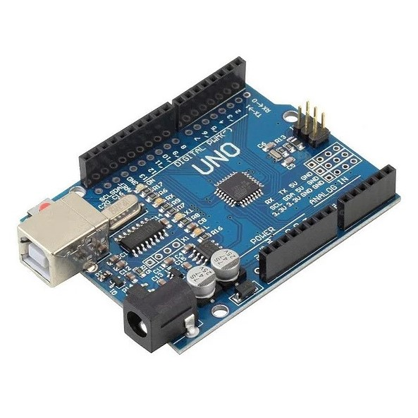
            <figcaption style="text-align: center;"><em><a href="https://docs.arduino.cc/hardware/uno-rev3/">Fig. 1: Arduino Uno</a></em></figcaption>
            </figure>
        

        

            <figure style="text-align: center;">
            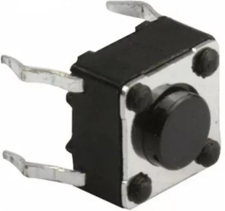
            <figcaption style="text-align: center;"><em><a href="https://circuitdigest.com/electronic-circuits/push-button-led-circuit">Fig. 2: Botão</a></em></figcaption>
            </figure>
        

    

    
   - **Descrição:** Foi utilizada a plataforma online *Wokwi* para simular o circuito *Contador de Interrupções Externas* com o *Arduino* a fim de observar o código fonte, montagem do circuito e funcionamento básico do sistema ao exibir textos no Serial Monitor.
   
    - **Ligação dos circuitos e código arduino:**
    

        

            <figure style="text-align: center;">
                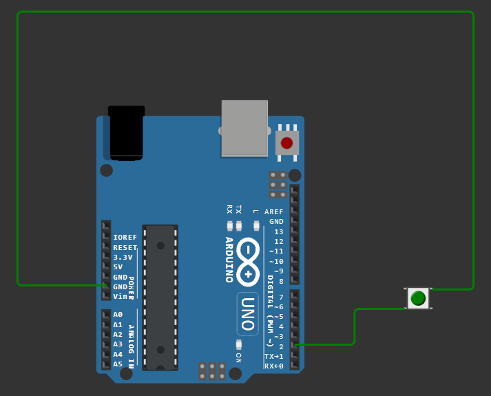
                <figcaption style="text-align: center;"><em>Fig. 3: Circuito montado</em></figcaption>
            </figure>
        

        

            

    <pre><code class="ino" contentEditable="false">
        /* Contador de Interrupções Externas */
        #define botao 2

        int cont;
        void setup() {
        pinMode(botao,INPUT_PULLUP);
        Serial.begin(9600);
        }

        void loop() {
        if(digitalRead(botao)==0){
            cont++;
            Serial.println(cont);
            delay(400);
        }
        
    </code></pre>
        

            <figcaption style="text-align: center;"><em>Código 1: arquivo .ino  do Contador de Interrupções Externas" </em></figcaption>
        

    

2. **Medidor de Tempo de Interrupção:**:
    - **Componentes Utilizados**: *Arduino Uno*, *Botão*.
    

        

            <figure style="text-align: center;">
            
            <figcaption style="text-align: center;"><em><a href="https://docs.arduino.cc/hardware/uno-rev3/">Fig. 4: Arduino Uno</a></em></figcaption>
            </figure>
        

        

            <figure style="text-align: center;">
            
            <figcaption style="text-align: center;"><em><a href="https://circuitdigest.com/electronic-circuits/push-button-led-circuit">Fig. 5: Botão</a></em></figcaption>
            </figure>
        

    

    - **Descrição**: Os participantes projetaram um circuito utilizando o *Arduino* e os componentes mencionados. O início e o fim do tempo são disparados por dois botões diferentes, cada um conectado a seu próprio pino de interrupção (pino 2 e pino 3). Mostrando o tempo decorrido no Serial Monitor.

    - **Ligação dos circuitos e código arduino:**
    

        

            <figure style="text-align: center;">
                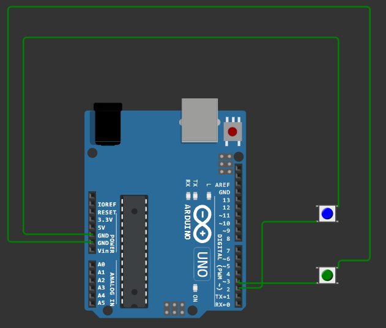
                <figcaption style="text-align: center;"><em>Fig. 6: Circuito montado</em></figcaption>
            </figure>
        

        

            

    <pre><code class="ino" contentEditable="false">
        unsigned long tempoInicial;
        unsigned long tempoFinal;
        unsigned long tempoDecorrido;
        #define botao 2
        #define botao2 3

        void setup() {
        pinMode(botao,INPUT_PULLUP);
        pinMode(botao2,INPUT_PULLUP);
        Serial.begin(9600);
        }

        void loop() {
        if(!digitalRead(botao)) {
            tempoInicial = millis();
            delay(100);
        }

        if(!digitalRead(botao2)){
            tempoFinal = millis();
            tempoDecorrido=tempoFinal-tempoInicial;
            Serial.println(tempoDecorrido);
            delay(100);
        }
    </code></pre>
        

            <figcaption style="text-align: center;"><em>Código 2: arquivo .ino para Medidor de Tempo de Interrupção</em></figcaption>
        

    

3. **Alarme de Interrupção com Cancelamento:**:
    - **Componentes Utilizados**: *Arduino Uno*, *Botão*, *Buzzer*, *led*.
        

            

                <figure style="text-align: center;">
                
                <figcaption style="text-align: center;"><em><a href="https://docs.arduino.cc/hardware/uno-rev3/">Fig. 7: Arduino Uno</a></em></figcaption>
                </figure>
            

            

                <figure style="text-align: center;">
                
                <figcaption style="text-align: center;"><em><a href="https://circuitdigest.com/electronic-circuits/push-button-led-circuit">Fig. 8: Botão</a></em></figcaption>
                </figure>
            

            

                <figure style="text-align: center;">
                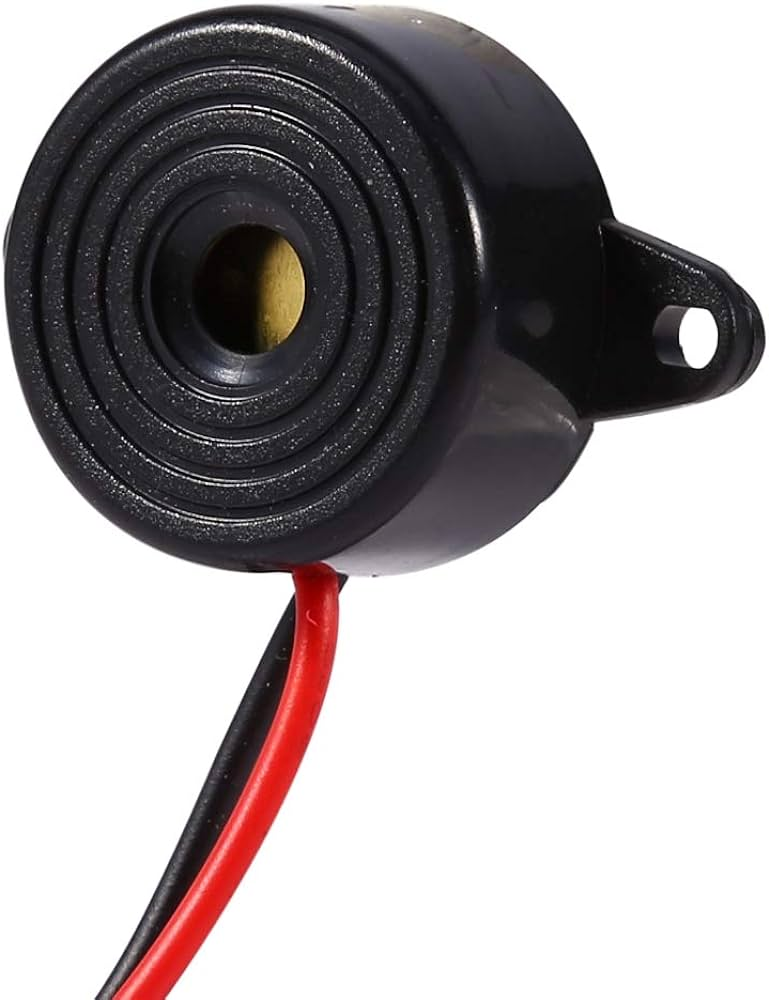
                <figcaption style="text-align: center;"><em><a href="https://www.arduino.cc/reference/en/libraries/buzzer/">Fig. 9: Buzzer</a></em></figcaption>
                </figure>
            

            

                <figure style="text-align: center;">
                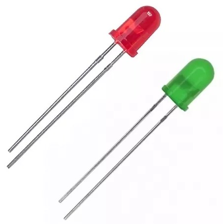
                <figcaption style="text-align: center;"><em><a href="https://electronicsclub.info/leds.htm">Fig. 10: Buzzer</a></em></figcaption>
                </figure>
            

        

    - **Descrição**: Os participantes projetaram um sistema de alarme onde uma interrupção externa ativada por um sensor de movimento (pushbutton, conectado ao pino 2) ligando um LED e um buzzer para emitir som.

    - **Ligação dos circuitos e código arduino:**
    

        

            <figure style="text-align: center;">
                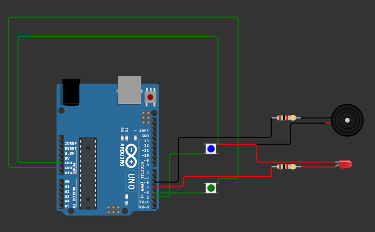
                <figcaption style="text-align: center;"><em>Fig. 11: Circuito montado</em></figcaption>
            </figure>
        

        

            

    <pre><code class="ino" contentEditable="false">
        #define botao 2
        #define botao2 3
        #define led 4
        #define buzzer 5

        void setup() {
        pinMode(botao,INPUT_PULLUP);
        pinMode(botao2,INPUT_PULLUP);
        pinMode(led,OUTPUT);
        pinMode(buzzer,OUTPUT);
        Serial.begin(9600);
        }

        void loop() {
        if(digitalRead(botao)==0){
            delay(400);
            digitalWrite(led, HIGH);
            tone(buzzer, 261);
        }
        if(digitalRead(botao2)==0){
            delay(400);
            digitalWrite(led, LOW);
            noTone(buzzer);
        }
        }
    </code></pre>
        

            <figcaption style="text-align: center;"><em>Código 3: arquivo .ino para Alarme de Interrupção com Cancelamento</em></figcaption>
        

    

4. **Alarme com Função Soneca:**:
   - **Componentes Utilizados**: *Arduino Uno*, *Botão*, *Buzzer*.
        

             

                <figure style="text-align: center;">
                
                <figcaption style="text-align: center;"><em><a href="https://docs.arduino.cc/hardware/uno-rev3/">Fig. 12: Arduino Uno</a></em></figcaption>
                </figure>
            

            

                <figure style="text-align: center;">
                
                <figcaption style="text-align: center;"><em><a href="https://circuitdigest.com/electronic-circuits/push-button-led-circuit">Fig. 13: Botão</a></em></figcaption>
                </figure>
            

            

                <figure style="text-align: center;">
                
                <figcaption style="text-align: center;"><em><a href="https://www.arduino.cc/reference/en/libraries/buzzer/">Fig. 14: Buzzer</a></em></figcaption>
                </figure>
            

        

   - **Descrição**: Os participantes fizeram um alarme que, ao ser disparado, emite um som e, se a função soneca for ativada, silencia por um período de tempo antes de soar novamente com um buzzer e dois botoes.

    - **Ligação dos circuitos e código arduino:**
    

        

            <figure style="text-align: center;">
                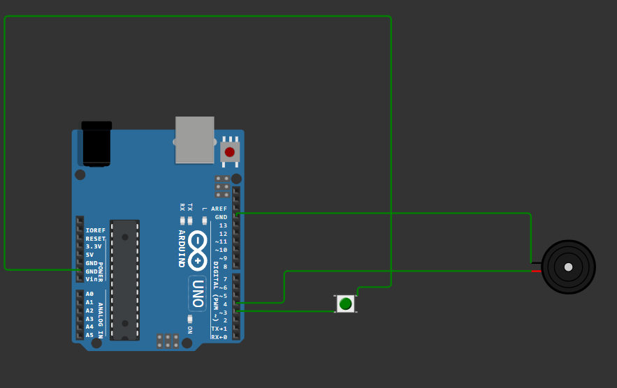
                <figcaption style="text-align: center;"><em>Fig. 15: Circuito montado</em></figcaption>
            </figure>
        

        

            

    <pre><code class="ino" contentEditable="false">
        const int botaoSonecaPin = 3; // Pino conectado ao botão de soneca
        const int buzzerPin = 4;      // Pino conectado ao buzzer

        unsigned long tempoAlarme = 10000;
        unsigned long periodoSoneca = 5000;
        unsigned long tempoAtual;
        unsigned long tempoDesligar;
        bool teste = false;

        void setup() {
        Serial.begin(9600);
        pinMode(botaoSonecaPin, INPUT_PULLUP); // Define o pino do botão de soneca como entrada com pull-up
        pinMode(buzzerPin, OUTPUT);            // Define o pino do buzzer como saída
        }

        void loop() {
        tempoAtual = millis();

        if (tempoAtual == tempoAlarme) {
            tone(buzzerPin, 261); // Toca o buzzer na frequência de 261Hz
            teste = true;
            tempoDesligar = tempoAtual + 30000;
        }

        if (teste && digitalRead(botaoSonecaPin) == 0) {
            tempoAlarme = tempoAtual + periodoSoneca;
            noTone(buzzerPin);

        } else if (tempoDesligar == tempoAtual) {
            noTone(buzzerPin);
        }
        }

    </code></pre>
        

            <figcaption style="text-align: center;"><em>Código 4: arquivo .ino para Alarme com Função Soneca</em></figcaption>
        

    

## Resultados
Após a montagem dos circuitos propostos em cada exercício, foi possível fazer a simulação e observar o comportamento em cada caso, conforme demonstrado abaixo:

1. **Contador de Interrupções Externas**: ([Exercício 01/Wokwi](https://wokwi.com/projects/395537497684810753))

    <figure style="text-align: center;">
        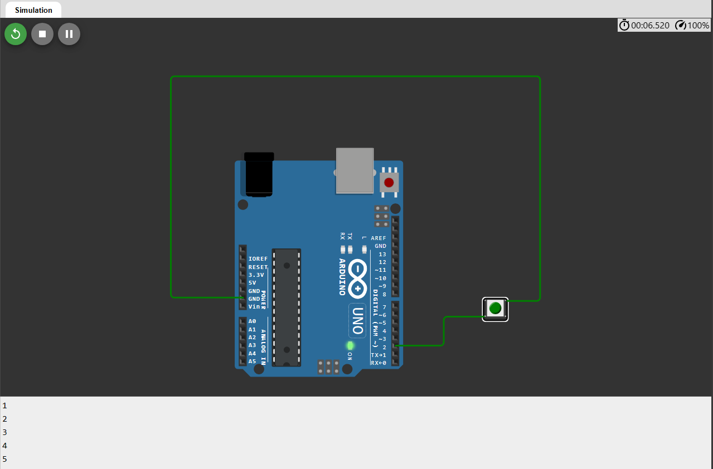
        <figcaption style="text-align: center;"><em>Fig. 16: Simulação em execução</em></figcaption>
    </figure>

Utilizando a plataforma online *Wokwi* para simular o circuito *Contador de Interrupções Externas* com o *Arduino* foi possível ver o código utilizado no *Arduino* que faz a interrupção externa para contar o número de vezes que um botão é pressionado. Posteriormente, foi exibido no Serial Monitor do *Arduino* a contagem dos números conforme a interrupção externa é realizada. 

2. **Medidor de Tempo de Interrupção**: ([Exercício 02/Wokwi](https://wokwi.com/projects/395538382437667841))

    <figure style="text-align: center;">
        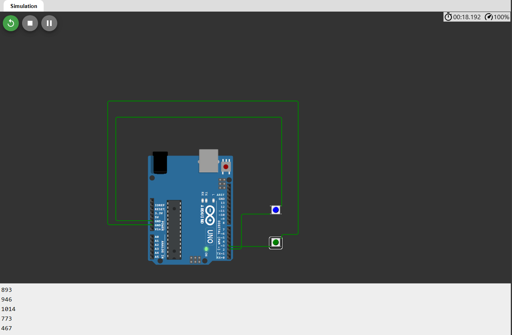
        <figcaption style="text-align: center;"><em>Fig. 17: Simulação em execução</em></figcaption>
    </figure>

Os participantes obtiveram sucesso na criação do circuito utilizando o Arduino e os componentes especificados. Além disso, conseguiram desenvolver um programa que faz a diferença do tempo inicial de quando a primeira interrupção externa foi realizada com a segunda interrupção externa. Posteriormente, o valor deste Cálculo foi exibido no Serial Monitor do *Arduino*.

3. **Alarme de Interrupção com Cancelamento**: ([Exercício 03/Wokwi](https://wokwi.com/projects/395539566464585729))

    <figure style="text-align: center;">
        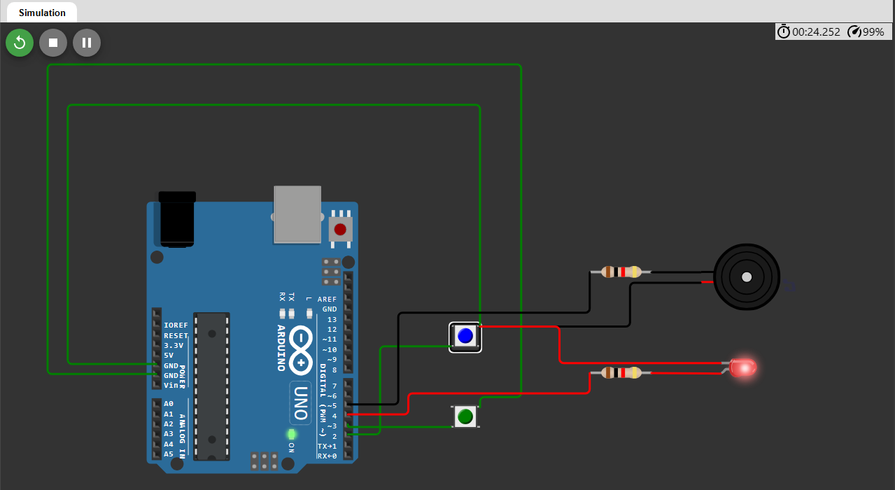
        <figcaption style="text-align: center;"><em>Fig. 18: Simulação em execução</em></figcaption>
    </figure>

Após o desenvolvimento do circuito utilizando o *Arduino* e o *Buzzer*, os participantes realizaram um sistema de alarme onde uma interrupção externa ativada por um sensor de movimento (pushbutton, conectado ao pino 2) ligue um LED e emita um som através de um buzzer e mantenha o alarme ligado. Após realizar a prática, também foi possível adicionar um botão funcionando como uma chave externa para desligar o alarme e o led junto.

4. **Alarme com Função Soneca**: ([Exercício 04/Wokwi](https://wokwi.com/projects/395540517301828609))

    <figure style="text-align: center;">
        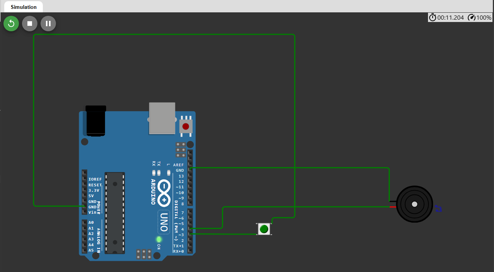
        <figcaption style="text-align: center;"><em>Fig. 19: Simulação em execução</em></figcaption>
    </figure>

Ao adicionar um *Buzzer* ao circuito já existente, os participantes do experimento avançaram em sua criação ao atribuir um botão de soneca ao pino 3 e o buzzer ao pino 4 do *Arduino*. Com essas modificações, o buzzer é acionado quando o alarme dispara. Se a função soneca for ativada, o alarme fica temporariamente silenciado antes de tocar novamente após um determinado intervalo de tempo. E se não for desligado através do botão de soneca, o alarme é automaticamente desativado após 30 segundos. 

Em resumo, os resultados desses exercícios refletem um progresso significativo no entendimento e na aplicação dos conceitos relacionados a entradas e saídas digitais no Arduino, capacitando os alunos para enfrentar desafios mais complexos no desenvolvimento de projetos futuros.

A seguir, estão disponíveis os *links* de cada exercício realizado:

* [Exercício 01/Wokwi](https://wokwi.com/projects/395537497684810753)
* [Exercício 02/Wokwi](https://wokwi.com/projects/395538382437667841)
* [Exercício 03/Wokwi](https://wokwi.com/projects/395539566464585729)
* [Exercício 04/Wokwi](https://wokwi.com/projects/395540517301828609)

## Conclusão

Neste projeto, exploramos o *Arduino* e a plataforma *Wokwi* para aprender sobre microcontroladores e sistemas embarcados. Através de exercícios práticos, como simular o circuito *"Contador de Interrupções Externas"* e projetar circuitos com botões e *Buzzers*, desenvolvemos habilidades essenciais para controlar as entradas e saídas digitais deste microcontrolador.

## Referências
- Arduino. Disponível em: [https://www.arduino.cc/](https://www.arduino.cc/). Acesso em: 18 de abril de 2024.
- Wokwi. Disponível em: [https://wokwi.com/](https://wokwi.com/). Acesso em: 18 de abril de 2024.
- Circuito "Contador de Interrupções Externas" plataforma Wokwi. Disponível em: [https://wokwi.com/projects/322062421191557714](https://wokwi.com/projects/322062421191557714). Acesso em: 18 de abril de 2024.
- Arduino Uno. Disponível em: [https://docs.arduino.cc/hardware/uno-rev3/](https://docs.arduino.cc/hardware/uno-rev3/). Acesso em: 18 de abril de 2024.
- LCD 16x2. Disponível em: [https://docs.arduino.cc/learn/electronics/lcd-displays/](https://docs.arduino.cc/learn/electronics/lcd-displays/). Acesso em: 18 de abril de 2024.
- Push Button. Disponível em: [https://circuitdigest.com/electronic-circuits/push-button-led-circuit](https://circuitdigest.com/electronic-circuits/push-button-led-circuit). Acesso em: 18 de abril de 2024.
- Led. Disponível em: [https://electronicsclub.info/leds.htm](https://electronicsclub.info/leds.htm). Acesso em: 18 de abril de 2024.
- Display de 7 segmentos. Disponível em: [https://www.electronicsforu.com/resources/7-segment-display-pinout-understanding](https://www.electronicsforu.com/resources/7-segment-display-pinout-understanding). Acesso em: 18 de abril de 2024.
